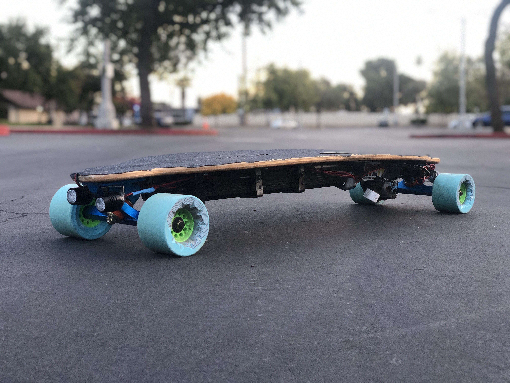
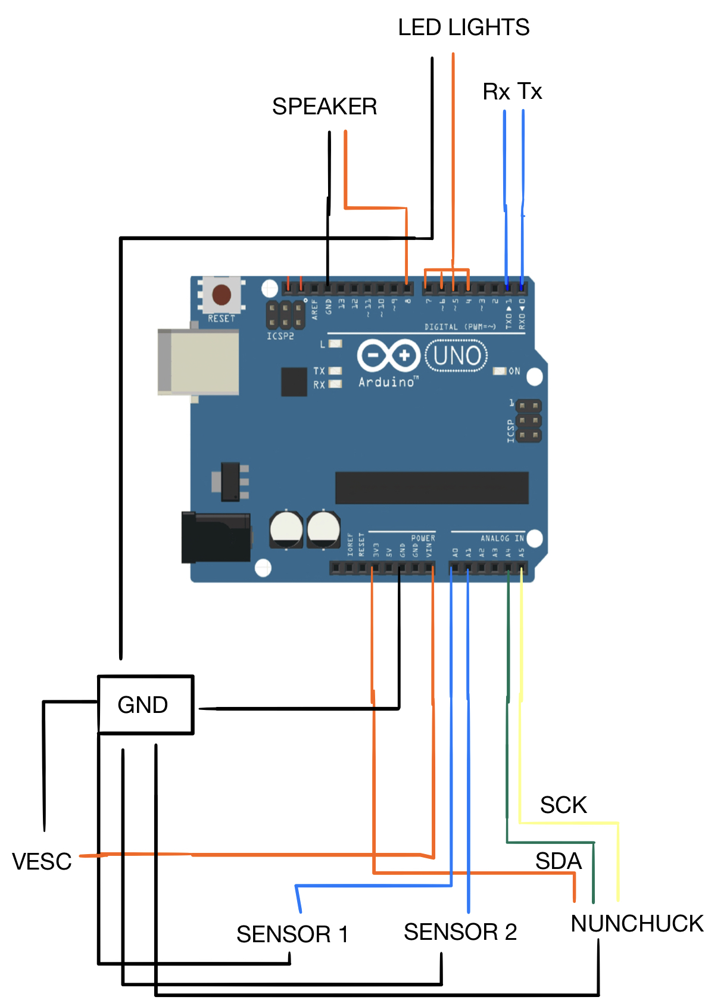
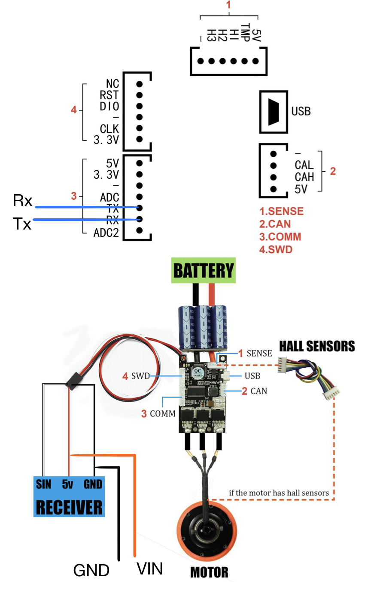

# Tboard

An Arduino-powered electric skateboard.

## Introduction

As a UCR student living off-campus, I believe that a suitable method of transportation is essential. During previous years, I have commuted to campus using various forms of transportation including bikes, skateboards, RTA shuttles, and by car, and all seem to have a downside to them. Recently, the use of rental electric vehicles have grown substantially and have impacted the way people commute. For my project, I decided to create an electric skateboard.

An electric skateboard would be an efficient and easy way for a student to get to campus. It maintains the size of a regular skateboard, eliminates the use for a bike lock, decreases the time it takes to get to campus, and saves the user money from gas and parking expenses. This build will also be much cheaper than other brands. The board will utilize two pressure sensors which will allow the board to move only when at least one of the user’s feet are on the deck. It will also come with headlights and taillights. The board will also play sounds when the board turns off and when the foot placement is detected. Any student living within a surface-road distance to campus and looking for an efficient and affordable method of transportation would highly enjoy this project.



## About

The Tboard is an Arduino-powered electric skateboard. It has built-in headlights and tail lights, as well as two sensors on top of the longboard deck to detect foot placement. A built-in speaker plays specific tones upon startup and foot-sensor detection for an enjoyable user experience. It is also controlled with a wireless Wii Nunchuk. The Tboard boasts a speed of over 20+mph with a battery life that lasts 10-12 miles on a single charge. And in summary, the cost of this project came down to 1/5th the price of the standard Boosted Board. To this day, I use this board to commute to and from campus.

The primary goal of this project was to focus on the safety of the board. If the user happens the fall off the board, the controls would lock and the board will slow itself down to a complete stop. The user also cannot trigger the board if he/she were to accidentally press the throttle.

## Wiring Diagram





## Features

#### Startup Tone
Upon startup, the setup() function will run and initiate all input and output variables, including the nunchuk and VESC. The VESC, or Vedder Electronic Speed Controller, controls the amount of current sent to the motor. I connected a separate power/GND to the Arduino so that the VESC will power the Arduino as well, eliminating the need for a separate power source. When initialized, the Arduino will then play the first tone to signal that the board is ready to operate.

#### Arduino waits for nunchuk connection
When the user turns on the board, the chances that the nunchuck will connect with the receiver at that moment is near impossible. This requires a conditional that resets the nunchuk to the proper values when it connects. To begin, the default value sent to the Arduino when the nunchuk is not connected is 875. This stays in a loop until the nunchuk connects. The initial nunchuk value when it connects to the receiver is 255, which is the maximum value.
```
if(nunchuk.analogY == 255)
```
If 255 was sent directly sent to the motor, it would spin at full power if the user were on the board. To prevent this, another conditional will re-initialize the nunchuk when the value becomes 255. This ultimately resets the value to 128, the zero value.  

```
if(nunchukConnected  == 1 && setupComplete == 0)
{
    nunchuk.init();
    setupComplete = 1;
}
```

### Begin state machine
After the Arduino has successfully verified that the nunchuk is connected, the state machine begins.

### Arduino receives sensor values

 Two velostat sensors lie underneath the grip tape of the board, detecting foot placement. For this board, the threshold values are 46 and 108, based on how much pressure is on the sensors already. When the average person with some sort of footwear steps on the board, the values drop below 30. Therefore when either one of the sensors detects the users feet, the board will be able to accelerate.

 ```
 if(frontSensorValue < 21 || backSensorValue < 38)
   feetOnDeck = 1;
```

#### Arduino receives nunchuk input

 To connect the nunchuk to the Arduino, I had purchase a nunchuk extension cable and cut the male side, exposing the wires. The Arduino is powered through GND, 3.3V, Clock, and Data. Clock and Data were connected to two analog ports on the Arduino and 3.3/GND were connected to their respective ports. The value of the wireless nunchuk ranges from 2 to 255, with 128 being the zero value.

 ```
void JoystickADC()
{
  nunchuk.update();
  throttle = nunchuk.analogY;
}
```

#### Convert nunchuk input into ratio for motor current

I calibrated the VESC to output a maximum of -50A to 50A into the motor, which is an interval with good throttling and also a considerable amount of braking power. Negative amperage allows for reverse as well. I had to calculate a ratio between the motor amp interval and the nunchuk interval, which would send max amps at max nunchuk value and vice versa, as well as setting 128 equal to 0A. Because analog values are not always the most consistent, I set a threshold of +- 4 (123 - 132) to be 0A to the motor, for safety purposes. The equations are listed below.

```
Acceleration: ( nunchuk_value - 131 ) * 0.4 = motor_current
```

```
Deceleration/reverse: - ( |nunchuk_value - 123| * 0.4 ) = motor_current
```

#### Arduino sends motor current

 Through SolidGeek’s & RollingGecko’s VESCUART library, the Arduino communicated to the VESC through UART. UART is one of the many ways the VESC can communicate with the Arduino or any electric skateboard remote. Originally, I chose to communicate with the VESC through PPM, as it was easier to implement along with a pre-made function in the library. But UART allows negative values to be sent to the VESC, creating better braking potential and the ability to reverse the board.

 ```
 VESCUART.setCurrent(current);
 ```

#### Turn on headlights and brake lights

The headlights run in a separate state machine. This helps because it does not crowd the main state machine with more if-else conditionals. Four states control the headlights, just like a regular breadboard button. The lights will turn on/off upon release of the button. The lights are pre-made lights off Amazon, that were rechargeable and had their own separate programming which could change the LED pattern with the press of the light. I was able to disassemble and modify them so that they could be controlled through the Arudino.

#### Lock and slow board if necessary

 When both sensors rise above the threshold value simulating the user falling off, the nunchuk locks and 0A of current is sent to the motor to slow the board down to a complete stop. This is the first if-else conditional in every single state and is the top priority of this board. The Arduino will play specific tones when the sensors detect foot placement or foot removal

 ## Known Bugs

 * The wireless nunchuk can only be held at a certain distance until it disconnects.
  * This can be bad, as the board will maintain a constant speed upon disconnecting. I would have to extend the nunchuk cable and place it in a well-exposed position versus underneath the board.
 * The lights turn off when a significant amount of throttle is applied to the motor.
  * Because the VESC controls both the motor and the Arduino, I suspect that when an increase in power is needed, especially when commuting uphill, it directs more power into the motor and therefore turns off the lights temporarily.


## Acknowledgements

Special thanks to Benjamin Vedder and his [VESC Tool](https://vesc-project.com/vesc_tool), SolidGeek's [VescUART](https://github.com/SolidGeek/VescUart) library, and Gabriel Bianconi's [Arduino-Nunchuk](https://github.com/GabrielBianconi/arduino-nunchuk) library.
